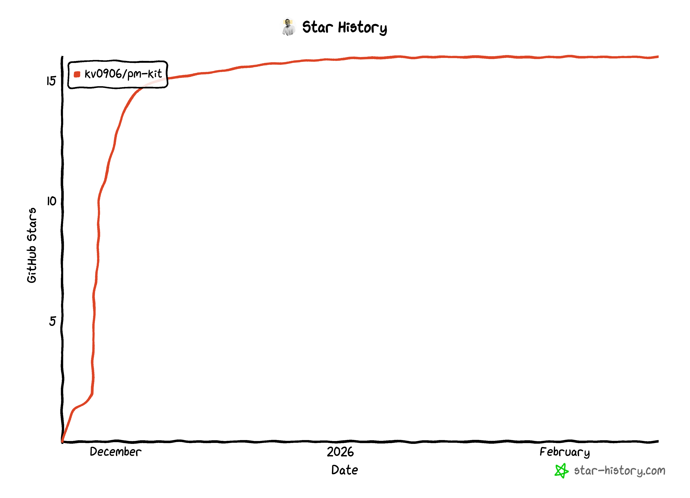

# PM-Kit

**AI-augmented knowledge vault for Technical PMs and Engineering Leads.**

> You input raw thoughts → AI structures, links, and stores → You query for clarity

PM-Kit is an open-source framework for building personal knowledge management systems powered by AI agents. Designed for teams managing PRDs, ADRs, sprints, OKRs, and architecture decisions.

---

## Quick Start

### Automated Setup

```bash
git clone git@github.com:kv0906/pm-kit.git
cd pm-kit
./scripts/setup.sh
```

### Manual Setup

1. Clone this repo
2. Edit `_core/config.yaml` with your projects
3. Start using skills:
   ```
   /onboard                                          # Load vault context
   /daily project-alpha: shipped login, wip checkout  # Log standup
   /progress project-alpha                            # View status
   /push                                              # Save changes
   ```

---

## Skills (15)

### User-Invocable (13)

| Skill | Purpose |
|-------|---------|
| `/daily` | Multi-project standup with keyword detection |
| `/progress` | Cross-project status synthesis |
| `/block` | Flag a blocker with severity/owner/due |
| `/decide` | Log a decision with alternatives |
| `/doc` | Draft PRD/spec/document |
| `/meet` | Process meeting notes → extract decisions, blockers, actions |
| `/inbox` | Quick capture + batch processing |
| `/ask` | Fast vault Q&A |
| `/health` | Vault health: broken links, orphans, stats |
| `/adr` | Architecture Decision Record |
| `/weekly` | Sprint retro (Collect → Reflect → Plan) |
| `/push` | Git commit and sync |
| `/onboard` | Load _core/ + CLAUDE.md context |

### Auto-Invoked (2)

| Skill | Purpose |
|-------|---------|
| `vault-ops` | Core file read/write/link operations |
| `okr-tracking` | OKR progress calculation, roadmap alignment |

---

## Agents (4)

| Agent | Purpose |
|-------|---------|
| **Scribe** | Note creation — knows all templates and naming conventions |
| **Analyst** | Deep synthesis, trend analysis, sprint metrics, decision audits |
| **Maintainer** | Index regen, link validation, auto-archiving |
| **Processor** | GTD-style inbox routing |

Agents are invoked automatically by Claude based on your request.

---

## Folder Structure

```
pm-kit/
├── CLAUDE.md               # Vault context for Claude
├── _core/                  # config.yaml, MANIFESTO.md, PROCESSING.md
├── _templates/             # 9 note templates
├── .claude/                # Skills, agents, hooks, rules, output styles
├── inbox/                  # Unprocessed captures
├── index/                  # Project MOCs (auto-maintained)
├── daily/                  # YYYY-MM-DD.md (multi-project)
├── docs/{project}/         # PRDs, specs, documents
├── decisions/{project}/    # Decision records
├── blockers/{project}/     # Active blockers
├── meetings/               # Meeting notes
├── adrs/                   # Architecture Decision Records
├── roadmap/                # OKR objectives + key results
├── research/               # Exploration notes
├── reports/                # Generated reports (sprint retros, etc.)
└── _archive/               # Auto-archived by YYYY-MM/
```

---

## Key Features

### Keyword Detection
Mention "blocked" in `/daily` → prompt to create blocker note. "Decided" → prompt for decision note.

### Naming-as-API
Strict filename patterns (`YYYY-MM-DD-{slug}.md`) enable glob queries without a database.

### Multi-Project Dailies
One `daily/YYYY-MM-DD.md` per day with H2 sections per project. PMs managing multiple projects get a cross-project view.

### OKR Tracking
Quarterly objectives with measurable key results. `/weekly` calculates progress and surfaces stalled KRs.

### Auto-Archiving
Resolved blockers, shipped docs, superseded decisions → `_archive/YYYY-MM/` automatically.

### Session Task Progress
Multi-step skills show real-time progress spinners:
```
[Spinner] Collecting sprint data...
[Done] Phase 1 complete
[Spinner] Reflecting on OKR progress...
```

---

## Configuration

All domain config lives in `_core/config.yaml`:

```yaml
projects:
  - id: project-alpha
    name: Project Alpha
    description: Your product description here
    active: true
  - id: project-beta
    name: Project Beta
    description: Another product description
    active: true
```

For personal overrides, copy `CLAUDE.local.md.template` → `CLAUDE.local.md`.

See `docs/CUSTOMIZATION.md` for full customization options.

---

## Philosophy

See `_core/MANIFESTO.md` for the full philosophy. Key principles:

1. **You never organize** — AI does all filing
2. **Naming is the API** — Consistent naming enables queries
3. **Links over folders** — Discovery via connections
4. **Capture fast** — `/inbox` exists for speed, process later
5. **Systems over goals** — Build repeatable processes that compound

---

## Documentation

| Doc | What It Covers |
|-----|----------------|
| `docs/SETUP_GUIDE.md` | Installation, prerequisites, first session |
| `docs/CUSTOMIZATION.md` | Projects, templates, tags, integrations |
| `docs/WORKFLOW_EXAMPLES.md` | Daily PM workflow, sprint retros, ADRs |
| `docs/TROUBLESHOOTING.md` | Common issues and fixes |

---

## Requirements

- [Claude Code](https://claude.ai/code) — AI coding assistant (CLI)
- [Git](https://git-scm.com/) — version control
- [Obsidian](https://obsidian.md/) — markdown editor (optional but recommended)

---

## Contributing

Contributions welcome! Areas of interest:
- New domain examples (engineering, research, legal)
- Additional integrations (Jira, GitHub Issues)
- Improved templates
- Documentation

---

## License

MIT

---

## Star History

[](https://star-history.com/#kv0906/pm-kit&Date)

---

*PM-Kit: Weaving raw thought into structured, link-rich knowledge.*
