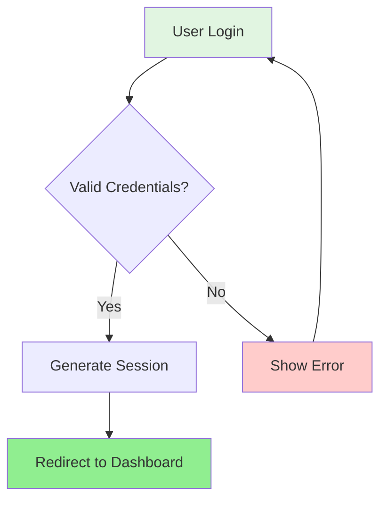
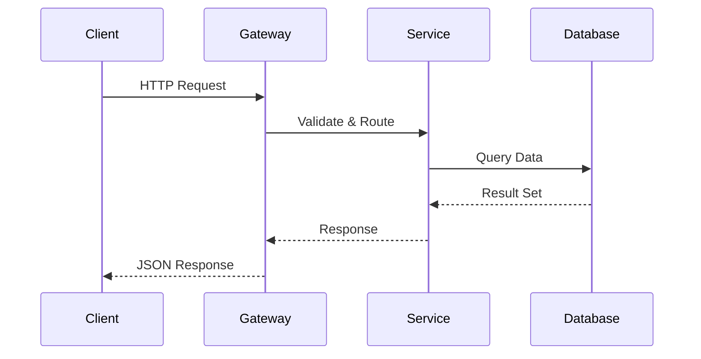
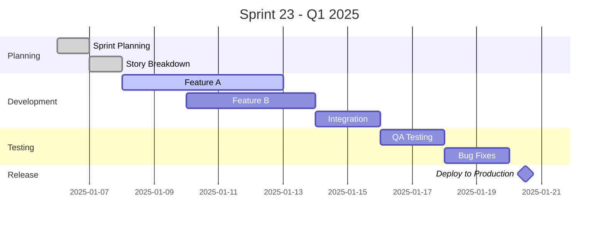
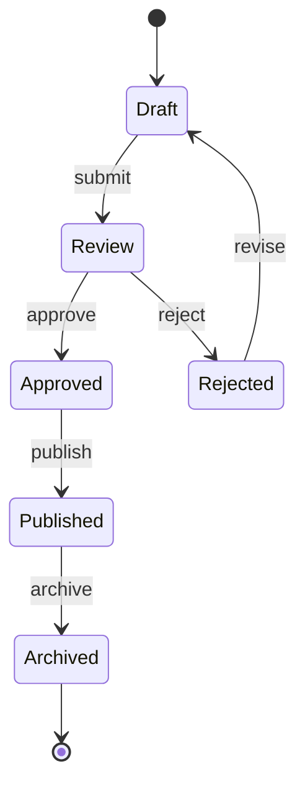
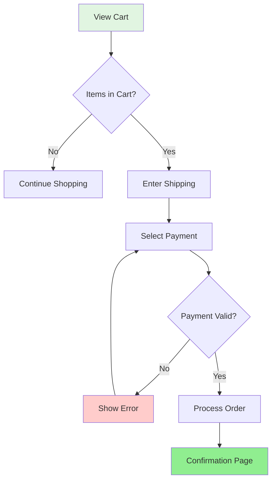
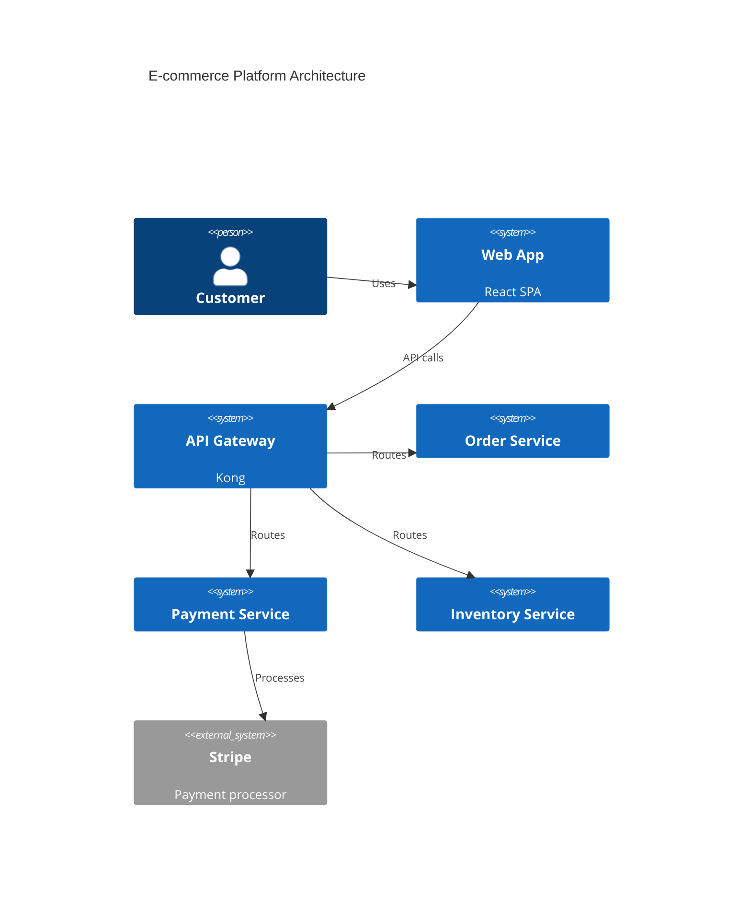
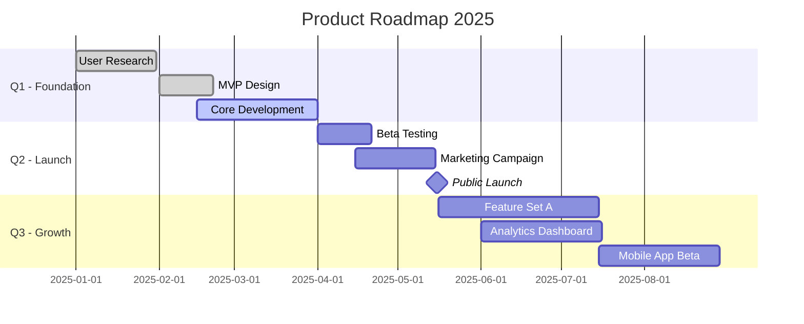

# Mermaid Diagram Examples and Exercises

Practice exercises and prompt patterns for generating Mermaid diagrams with Claude.

---

## Practice Exercises

### Exercise 1: User Flow
Create a flowchart for password reset:
1. Forgot password link
2. Email verification
3. Token validation
4. New password entry
5. Success/error states

**Solution approach**:
- Use flowchart TD
- Include decision diamonds for validation
- Show error paths with dashed lines
- Color code success (green) and error (red) states

---

### Exercise 2: API Sequence
Draw a sequence diagram for OAuth flow:
1. User authorization request
2. Redirect to provider
3. Callback with code
4. Token exchange
5. API access

**Solution approach**:
- Define participants: User, App, OAuth Provider, API
- Use solid arrows for requests
- Use dashed arrows for responses
- Add notes for important steps

---

### Exercise 3: Project Timeline
Create a Gantt chart for feature launch:
1. Research phase (2 weeks)
2. Design phase (1 week, after research)
3. Development (3 weeks, after design)
4. QA and launch (1 week, after dev)

**Solution approach**:
- Use `dateFormat YYYY-MM-DD`
- Group tasks by section (Research, Design, Dev, Launch)
- Use `after` dependencies for sequential tasks
- Mark launch as milestone

---

## Using with Claude

### Prompt Examples

**Generate Diagram**:
```
Create a Mermaid flowchart showing the checkout process with:
- Cart review
- Shipping address collection
- Payment processing (success/failure paths)
- Order confirmation
```

**Optimize Existing**:
```
Here's my Mermaid diagram:
[paste diagram]

Can you optimize it to prevent overlapping lines and improve clarity?
```

**Convert Description**:
```
Convert this to a Mermaid sequence diagram:
1. User clicks login
2. Frontend sends credentials to backend
3. Backend validates with database
4. Backend returns JWT token
5. Frontend stores token and redirects
```

**Add Styling**:
```
Take this flowchart and add color coding:
- Green for entry and success states
- Red for error states
- Blue for decision points

[paste diagram]
```

---

## Common Patterns

### Pattern 1: Authentication Flow


### Pattern 2: API Request Flow


### Pattern 3: Sprint Timeline


### Pattern 4: State Machine


---

## Quick Reference Card

```
Common Mermaid Patterns
━━━━━━━━━━━━━━━━━━━━━━━━━━━━━━━━━━━━━━━

Flowchart:
flowchart TD
    A[Box] --> B{Decision}
    B -->|Yes| C[Action]
    B -->|No| D[Alternative]

Sequence:
sequenceDiagram
    A->>B: Request
    B-->>A: Response

State:
stateDiagram-v2
    [*] --> State1
    State1 --> [*]

Gantt:
gantt
    dateFormat YYYY-MM-DD
    Task: t1, 2025-01-01, 7d
    Task2: after t1, 5d
━━━━━━━━━━━━━━━━━━━━━━━━━━━━━━━━━━━━━━━
```

---

## Real-World Examples

### E-commerce Checkout Flow


### Microservices Architecture


### Product Roadmap

