# Mermaid Diagrams for Product Managers

A comprehensive guide to creating professional Mermaid diagrams that render cleanly in modern tools - from flowcharts to architecture diagrams to Gantt charts.

## Why Mermaid Diagrams?

**Benefits for PMs**:
- **Visual rendering**: Beautiful diagrams in GitHub, Notion, Confluence
- **Version control**: Text-based, Git-friendly, shows changes clearly
- **Fast iteration**: Update diagrams by editing text
- **Professional output**: Publication-ready visualizations
- **Wide support**: Works in most modern documentation tools

**Use Cases**:
- User flows and journeys
- System architecture
- API interactions
- State machines
- Project timelines
- Database schemas

---

## Diagram Type Detection

Based on keywords, automatically select the appropriate diagram type:

| Keywords | Diagram Type |
|----------|--------------|
| user, flow, process, steps, journey | **Flowchart** or **User Journey** |
| API, request, interaction, sequence, call | **Sequence Diagram** |
| state, status, transitions, lifecycle | **State Diagram** |
| architecture, system, components, C4 | **C4 Architecture** |
| timeline, roadmap, schedule, gantt, project | **Gantt Chart** |
| database, schema, tables, relationships, ERD | **Entity Relationship Diagram** |

---

## Supported Diagram Types

### 1. Flowchart
**Best for**: Sequential processes with decision points, user flows

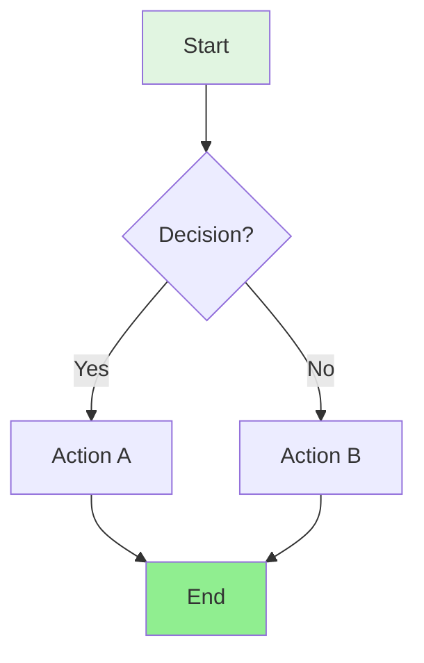

**Features**:
- Decision branches with `{ }`
- Multiple node shapes: `[ ]` `(( ))` `[( )]` `[[ ]]`
- Color styling with `style`
- Directional layouts: TD (top-down), LR (left-right)

**Node Shapes**:
- `[Text]` - Rectangle (standard process)
- `(Text)` - Rounded (start/end)
- `{Text}` - Diamond (decision)
- `[[Text]]` - Subroutine
- `[(Database)]` - Cylindrical (database)
- `((Text))` - Circle (connection point)

---

### 2. Sequence Diagram
**Best for**: System interactions, API flows, service communication

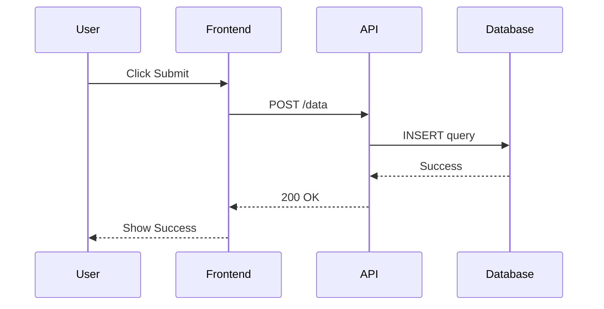

**Features**:
- Participant definitions
- Solid arrows `->` for requests
- Dashed arrows `-->` for responses
- Activation boxes
- Notes and loops

---

### 3. State Diagram
**Best for**: Application states, object lifecycles, workflow statuses

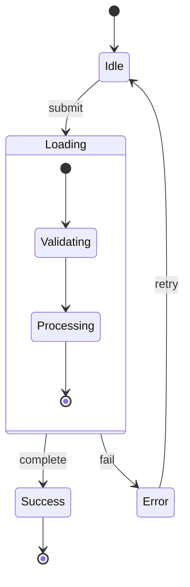

**Features**:
- Initial `[*]` and final states
- Transition labels
- Nested states
- Concurrent states with `--`

---

### 4. User Journey
**Best for**: Experience mapping with emotional sentiment

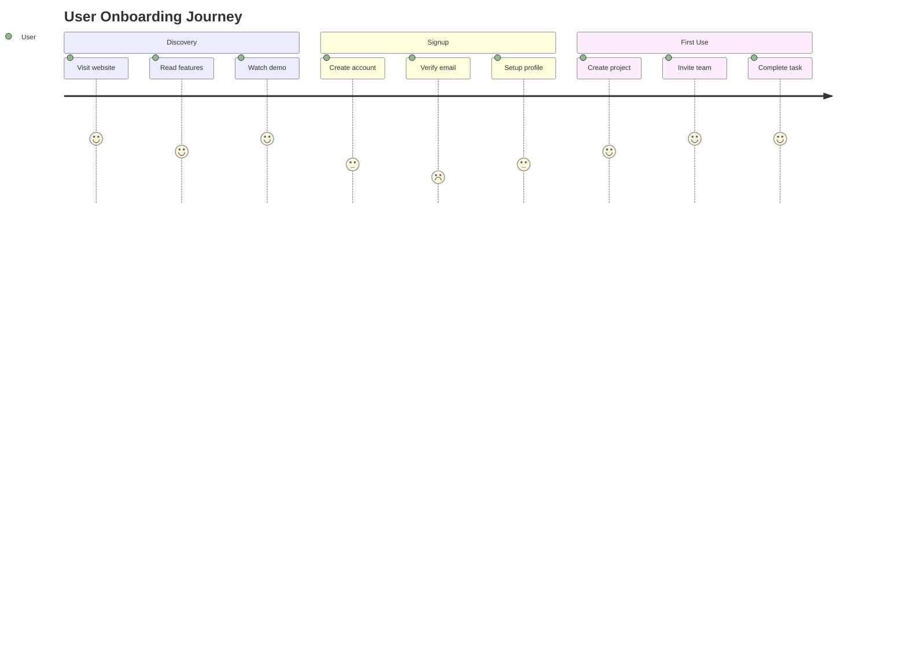

**Features**:
- Section grouping
- Sentiment scores (1-5)
- Actor assignment
- Timeline visualization

---

### 5. C4 Architecture Diagrams
**Best for**: System architecture, component relationships

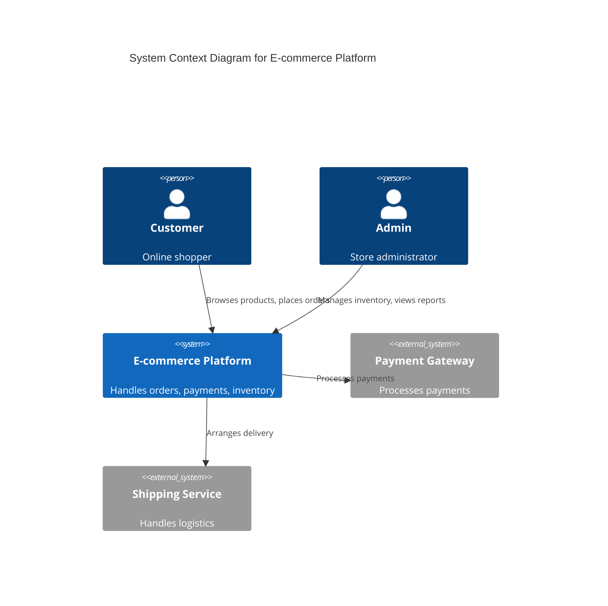

**C4 Levels Supported**:
1. **Context**: System and external actors
2. **Container**: Applications, databases, microservices
3. **Component**: Internal modules and classes

**Use Cases**:
- System architecture overviews
- Service dependency mapping
- Technical architecture documentation

---

### 6. Gantt Charts
**Best for**: Project timelines, roadmaps, sprint planning

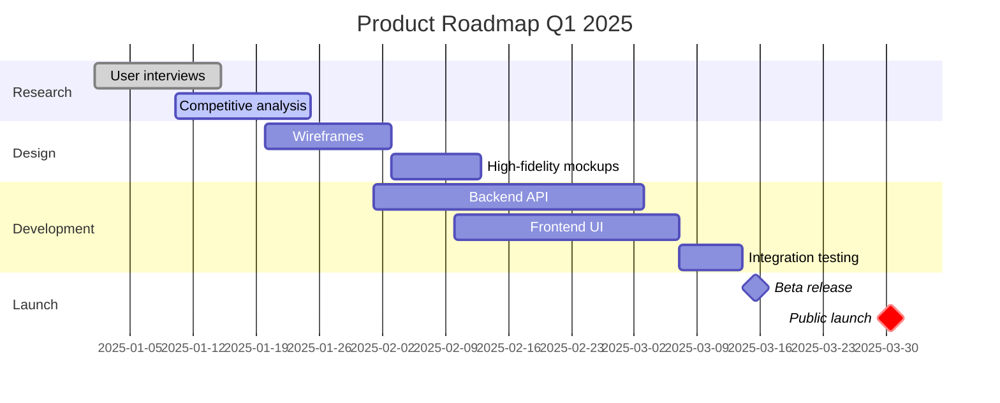

**Features**:
- Task dependencies with `after`
- Status markers: `done`, `active`, `crit`
- Milestones
- Section grouping
- Duration specification

---

### 7. Entity Relationship Diagrams
**Best for**: Database schemas, data models

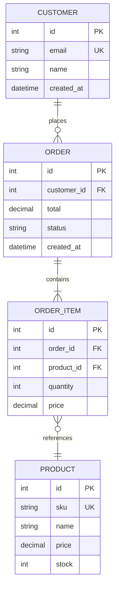

**Relationship Types**:
- `||--||` One to one
- `||--o{` One to many
- `}o--o{` Many to many
- `||--o|` One to zero or one

**Field Notations**:
- `PK` Primary Key
- `FK` Foreign Key
- `UK` Unique Key

---

## CRITICAL: Rendering Optimization Rules

### For ALL Diagram Types

**1. Prevent Overlapping & Crisscrossing**
- **Align subgraphs logically** → Stack vertically or position side-by-side with clear separation
- **Reduce cross-connections** → Minimize lines that cross over other elements
- **Use different link styles** → Differentiate relationships:
  - `-->` Solid arrows for primary flows
  - `-.->` Dashed arrows for secondary/cross-subgraph relationships
  - `..->` Dotted arrows for optional/conditional paths
- **Maintain natural reading order** → Default to `TD` (top-down) unless `LR` (left-right) is more logical
- **Ensure spacing** → Add whitespace between nodes to prevent clutter

**2. Clarity Best Practices**
- **Keep labels concise** → 2-5 words maximum per node
- **Group related items** → Use subgraphs for logical sections
- **Limit complexity** → If diagram has >15 nodes, consider breaking into multiple diagrams
- **Use consistent naming** → Follow a clear ID pattern (e.g., `step1`, `step2`, `decision1`)

**3. Syntax Error Prevention**
- **Avoid special characters** → Don't use `"`, `'`, `,`, or `()` in node IDs
- **Escape text with special chars** → Use quotes around labels: `A["Text with (special) chars"]`
- **Validate relationships** → Ensure all referenced IDs exist
- **Check bracket types** → Match opening/closing brackets correctly

---

### For Gantt Charts SPECIFICALLY

**4. Gantt-Specific Optimization**
- **Use correct date format** → Always `dateFormat YYYY-MM-DD`
- **Fix task dependencies** → Use `after [task_id]` to prevent date overlaps
- **Improve label placement** → Keep task names **short** so labels fit inside bars
- **Maintain clear phases** → Group related tasks under **section** headers
- **Ensure logical sequencing** → Later phases should start after key earlier tasks complete
- **Avoid manual date conflicts** → Don't specify overlapping dates for dependent tasks

**Example - Before (BAD):**
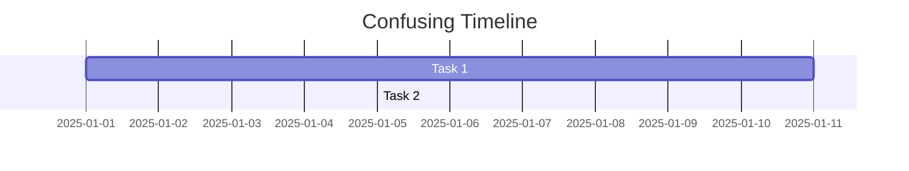

**Example - After (GOOD):**
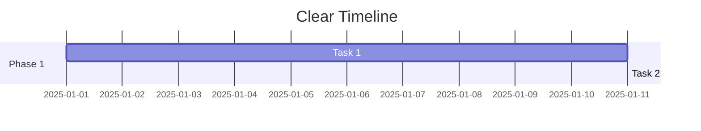

---

### For Flowcharts SPECIFICALLY

**5. Flowchart Optimization**
- **Align decision branches** → Keep Yes/No paths visually balanced
- **Avoid diagonal flows** → Use orthogonal (90-degree) connections
- **Stack subgraphs vertically** → Prevents side-by-side overlap
- **Use dashed lines for exceptions** → Error paths, edge cases

**Example - Before (BAD):**
```mermaid
flowchart LR
    A --> B
    A --> C
    B --> D
    C --> D
    D --> B  ❌ Creates circular confusion
```

**Example - After (GOOD):**
```mermaid
flowchart TD
    A[Start] --> B{Check}
    B -->|Valid| C[Process]
    B -.->|Invalid| E[Error Handler]
    C --> D[Complete]
    E -.-> A  ✓ Clear flow with dashed error path
```

---

## Optimization Verification Checklist

Before finalizing ANY diagram, verify:

**Rendering Checks:**
- [ ] No syntax errors (valid Mermaid syntax)
- [ ] All IDs are unique and referenced correctly
- [ ] Date formats correct (Gantt charts)
- [ ] No unescaped special characters in labels

**Visual Clarity Checks:**
- [ ] No overlapping lines or nodes
- [ ] Proper spacing between elements
- [ ] Logical flow direction (TD/LR)
- [ ] Appropriate use of dashed/dotted lines
- [ ] Subgraphs aligned and separated

**Complexity Checks:**
- [ ] <15 nodes per diagram (or split into multiple)
- [ ] Labels are concise (2-5 words)
- [ ] Related items grouped logically
- [ ] Natural reading order maintained

---

## Styling Guidelines

### Color Coding

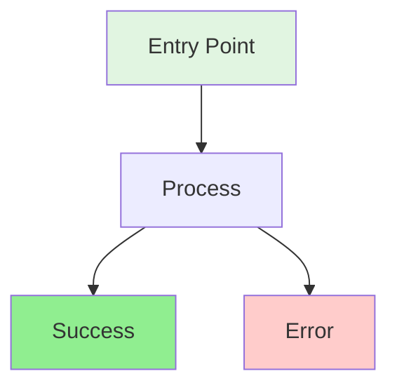

**Color Guide**:
- **Green** (`#e1f5e1`, `#90EE90`): Entry points, success states
- **Red** (`#ffcccb`): Error states, failures
- **Blue** (`#cce5ff`): Decision points, important processes
- **Yellow** (`#fff4cc`): Warning states, attention needed
- **Gray** (`#f0f0f0`): System actions, automated processes

---

## Common Pitfalls and Fixes

### Pitfall 1: Overlapping Connections
**Problem**: Lines crossing over nodes making diagram unreadable

**Solution**: Use subgraphs and different arrow styles
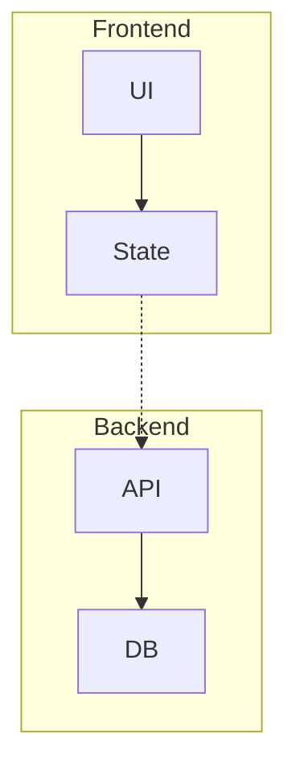

### Pitfall 2: Gantt Date Overlaps
**Problem**: Tasks with conflicting dates

**Solution**: Use `after` dependencies
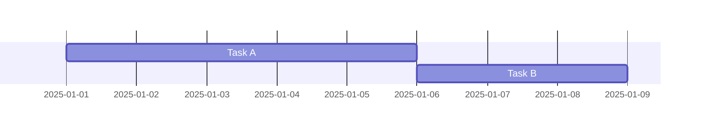

### Pitfall 3: Too Complex
**Problem**: Diagram with 20+ nodes is unreadable

**Solution**: Break into multiple diagrams or use C4 levels

### Pitfall 4: Special Characters
**Problem**: Node IDs with parentheses break syntax

**Solution**: Escape labels with quotes
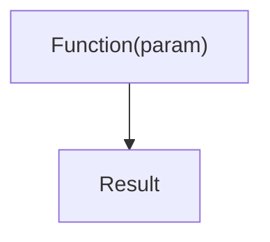

---

## Quality Checklist

Before finalizing diagrams, verify ALL of these:

**Content & Structure:**
- [ ] Diagram type appropriate for content
- [ ] All relationships/flows shown
- [ ] Labels clear and concise (2-5 words max)
- [ ] Color coding enhances understanding
- [ ] Edge cases documented
- [ ] Technical details included (if needed)
- [ ] Non-technical stakeholder can understand

**Rendering & Optimization:**
- [ ] Syntax is valid (will render correctly)
- [ ] No overlapping lines or crisscrossing connections
- [ ] Proper spacing between nodes/elements
- [ ] Subgraphs aligned logically (stacked or separated)
- [ ] Link styles differentiated (solid/dashed/dotted)
- [ ] Flow direction logical (TD/LR)
- [ ] Complexity limited (<15 nodes or split into multiple diagrams)

**Gantt-Specific (if applicable):**
- [ ] Date format is `YYYY-MM-DD`
- [ ] Task dependencies use `after [task_id]` correctly
- [ ] No overlapping dates for dependent tasks
- [ ] Task names are short (fit inside bars)
- [ ] Sections group related tasks clearly
- [ ] Phase transitions are logical

---

## Tools and Rendering

### Where Mermaid Works
- **GitHub**: Native rendering in markdown
- **Notion**: Copy-paste Mermaid blocks
- **Confluence**: Mermaid plugin available
- **GitLab**: Native support
- **VS Code**: Mermaid preview extensions
- **Obsidian**: Native support

### Online Editors
- **mermaid.live** - Official live editor
- **mermaid-js.github.io** - Documentation and examples

---

## Practice Exercises

### Exercise 1: User Flow
Create a flowchart for password reset:
1. Forgot password link
2. Email verification
3. Token validation
4. New password entry
5. Success/error states

### Exercise 2: API Sequence
Draw a sequence diagram for OAuth flow:
1. User authorization request
2. Redirect to provider
3. Callback with code
4. Token exchange
5. API access

### Exercise 3: Project Timeline
Create a Gantt chart for feature launch:
1. Research phase (2 weeks)
2. Design phase (1 week, after research)
3. Development (3 weeks, after design)
4. QA and launch (1 week, after dev)

---

## Using with Claude

### Prompt Examples

**Generate Diagram**:
```
Create a Mermaid flowchart showing the checkout process with:
- Cart review
- Shipping address collection
- Payment processing (success/failure paths)
- Order confirmation
```

**Optimize Existing**:
```
Here's my Mermaid diagram:
[paste diagram]

Can you optimize it to prevent overlapping lines and improve clarity?
```

**Convert Description**:
```
Convert this to a Mermaid sequence diagram:
1. User clicks login
2. Frontend sends credentials to backend
3. Backend validates with database
4. Backend returns JWT token
5. Frontend stores token and redirects
```

---

## Quick Reference Card

```
Common Mermaid Patterns
━━━━━━━━━━━━━━━━━━━━━━━━━━━━━━━━━━━━━━━

Flowchart:
flowchart TD
    A[Box] --> B{Decision}
    B -->|Yes| C[Action]
    B -->|No| D[Alternative]

Sequence:
sequenceDiagram
    A->>B: Request
    B-->>A: Response

State:
stateDiagram-v2
    [*] --> State1
    State1 --> [*]

Gantt:
gantt
    dateFormat YYYY-MM-DD
    Task: t1, 2025-01-01, 7d
    Task2: after t1, 5d
━━━━━━━━━━━━━━━━━━━━━━━━━━━━━━━━━━━━━━━
```

---

## Next Steps

Now that you understand Mermaid diagrams:

1. ✅ Practice with mermaid.live
2. ✅ Create a user flow for your product
3. ✅ Add diagrams to your next PRD
4. ✅ Use `/mermaid` command in PM-Kit
5. ✅ Explore `/ascii` for text-based diagrams

---

## Related Skills

- **Foundation**: ASCII Diagrams - Text-based alternatives
- **Next**: Excalidraw Skill - Hand-drawn style diagrams
- **Advanced**: API Basics - Understanding system interactions
