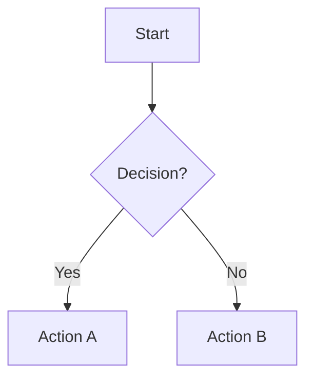
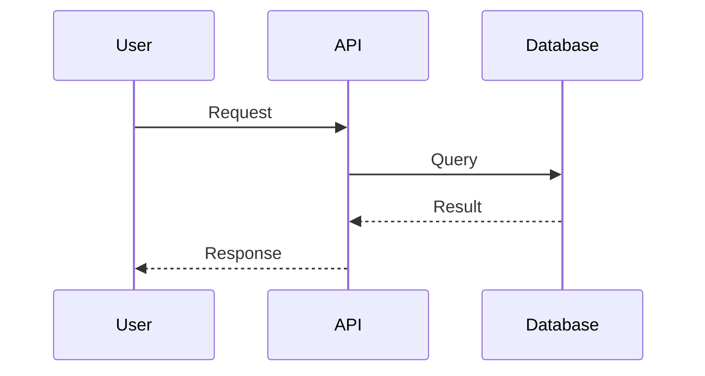
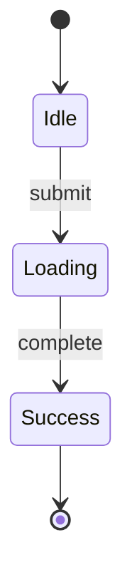
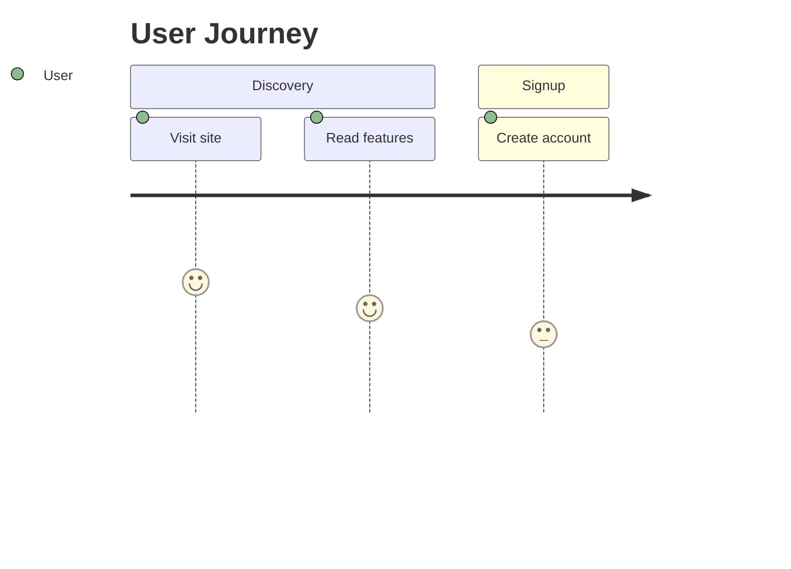
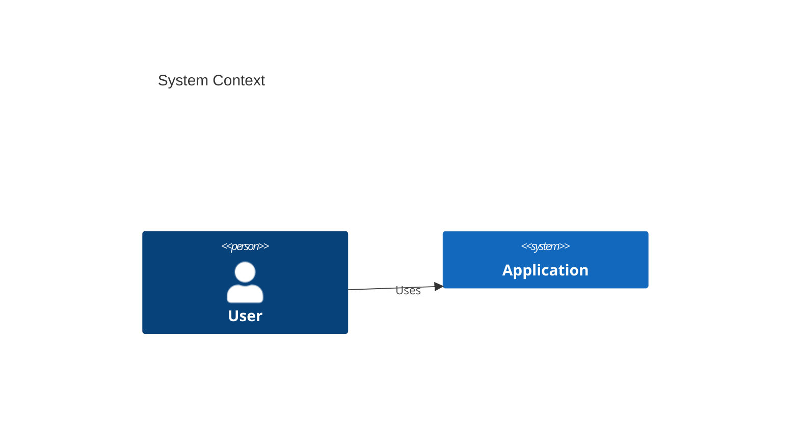
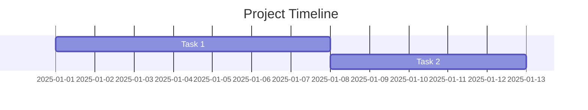
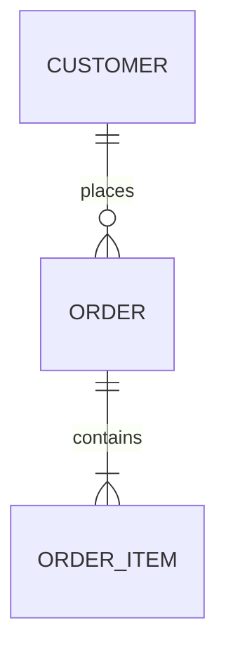

# Mermaid Diagrams for Product Managers

A comprehensive guide to creating professional Mermaid diagrams that render cleanly in modern tools - from flowcharts to architecture diagrams to Gantt charts.

> **Note**: This is an overview. For detailed syntax, optimization rules, and examples, see the `references/` directory.

## Why Mermaid Diagrams?

**Benefits for PMs**:
- **Visual rendering**: Beautiful diagrams in GitHub, Notion, Confluence
- **Version control**: Text-based, Git-friendly, shows changes clearly
- **Fast iteration**: Update diagrams by editing text
- **Professional output**: Publication-ready visualizations
- **Wide support**: Works in most modern documentation tools

**Use Cases**:
- User flows and journeys
- System architecture
- API interactions
- State machines
- Project timelines
- Database schemas

---

## Diagram Type Detection

Based on keywords, automatically select the appropriate diagram type:

| Keywords | Diagram Type |
|----------|--------------|
| user, flow, process, steps, journey | **Flowchart** or **User Journey** |
| API, request, interaction, sequence, call | **Sequence Diagram** |
| state, status, transitions, lifecycle | **State Diagram** |
| architecture, system, components, C4 | **C4 Architecture** |
| timeline, roadmap, schedule, gantt, project | **Gantt Chart** |
| database, schema, tables, relationships, ERD | **Entity Relationship Diagram** |

---

## Supported Diagram Types

### 1. Flowchart
**Best for**: Sequential processes with decision points, user flows

**Key Features**:
- Decision branches with `{ }`
- Multiple node shapes: `[ ]` (rectangle), `( )` (rounded), `{ }` (diamond), `(( ))` (circle)
- Color styling with `style`
- Directional layouts: TD (top-down), LR (left-right)

**Simple Example**:


📖 **See**: `references/syntax-reference.md` for complete flowchart syntax

---

### 2. Sequence Diagram
**Best for**: System interactions, API flows, service communication

**Key Features**:
- Participant definitions
- Solid arrows `->` for requests
- Dashed arrows `-->` for responses
- Activation boxes and notes

**Simple Example**:


📖 **See**: `references/syntax-reference.md` for complete sequence diagram syntax

---

### 3. State Diagram
**Best for**: Application states, object lifecycles, workflow statuses

**Key Features**:
- Initial `[*]` and final states
- Transition labels
- Nested states
- Concurrent states

**Simple Example**:


📖 **See**: `references/syntax-reference.md` for complete state diagram syntax

---

### 4. User Journey
**Best for**: Experience mapping with emotional sentiment

**Key Features**:
- Section grouping
- Sentiment scores (1-5)
- Actor assignment
- Timeline visualization

**Simple Example**:


📖 **See**: `references/syntax-reference.md` for complete user journey syntax

---

### 5. C4 Architecture Diagrams
**Best for**: System architecture, component relationships

**C4 Levels Supported**:
1. **Context**: System and external actors
2. **Container**: Applications, databases, microservices
3. **Component**: Internal modules and classes

**Simple Example**:


📖 **See**: `references/syntax-reference.md` for complete C4 diagram syntax

---

### 6. Gantt Charts
**Best for**: Project timelines, roadmaps, sprint planning

**Key Features**:
- Task dependencies with `after`
- Status markers: `done`, `active`, `crit`
- Milestones
- Section grouping

**Simple Example**:


📖 **See**: `references/syntax-reference.md` for complete Gantt chart syntax

---

### 7. Entity Relationship Diagrams
**Best for**: Database schemas, data models

**Key Features**:
- Relationship types (one-to-one, one-to-many, many-to-many)
- Field notations (PK, FK, UK)
- Entity attributes

**Simple Example**:


📖 **See**: `references/syntax-reference.md` for complete ERD syntax

---

## Critical Optimization Rules

**ALWAYS** follow these rules for clean, readable diagrams:

### For ALL Diagrams:
- ✅ Keep labels concise (2-5 words max)
- ✅ Limit complexity (<15 nodes per diagram)
- ✅ Use different line styles (solid/dashed/dotted)
- ✅ Align subgraphs logically
- ✅ Escape special characters with quotes

### For Gantt Charts:
- ✅ Use `dateFormat YYYY-MM-DD`
- ✅ Use `after [task_id]` for dependencies
- ✅ Keep task names short

### For Flowcharts:
- ✅ Stack subgraphs vertically
- ✅ Use dashed lines for error paths
- ✅ Align decision branches

📖 **See**: `references/optimization-rules.md` for complete optimization guidelines and quality checklist

---

## Tools and Rendering

### Where Mermaid Works
- **GitHub**: Native rendering in markdown
- **Notion**: Copy-paste Mermaid blocks
- **Confluence**: Mermaid plugin available
- **GitLab**: Native support
- **VS Code**: Mermaid preview extensions
- **Obsidian**: Native support

### Online Editors
- **mermaid.live** - Official live editor
- **mermaid-js.github.io** - Documentation and examples

---

## Quick Reference Card

```
Common Mermaid Patterns
━━━━━━━━━━━━━━━━━━━━━━━━━━━━━━━━━━━━━━━

Flowchart:
flowchart TD
    A[Box] --> B{Decision}
    B -->|Yes| C[Action]
    B -->|No| D[Alternative]

Sequence:
sequenceDiagram
    A->>B: Request
    B-->>A: Response

State:
stateDiagram-v2
    [*] --> State1
    State1 --> [*]

Gantt:
gantt
    dateFormat YYYY-MM-DD
    Task: t1, 2025-01-01, 7d
    Task2: after t1, 5d
━━━━━━━━━━━━━━━━━━━━━━━━━━━━━━━━━━━━━━━
```

---

## Using with Claude

### Example Prompts

**Generate a diagram**:
```
Create a Mermaid flowchart for the checkout process with cart review,
shipping, payment (success/failure paths), and confirmation.
```

**Optimize existing**:
```
Here's my Mermaid diagram: [paste]. Can you optimize it to prevent
overlapping lines and improve clarity?
```

**Convert description to diagram**:
```
Convert this to a Mermaid sequence diagram:
1. User clicks login
2. Frontend validates and calls API
3. Backend checks database
4. Returns JWT token
```

📖 **See**: `references/examples.md` for more prompt patterns and practice exercises

---

## Reference Documentation

This skill includes detailed reference documentation:

- **`references/syntax-reference.md`** - Complete syntax for all 7 diagram types
- **`references/optimization-rules.md`** - Rendering rules, styling, quality checklist
- **`references/examples.md`** - Practice exercises, prompt patterns, real-world examples

---

## Next Steps

Now that you understand Mermaid diagrams:

1. ✅ Practice with mermaid.live
2. ✅ Create a user flow for your product
3. ✅ Add diagrams to your next PRD
4. ✅ Use `/mermaid` command in PM-Kit
5. ✅ Explore `/ascii` for text-based diagrams

---

## Related Skills

- **Foundation**: ASCII Diagrams - Text-based alternatives
- **Next**: Excalidraw Skill - Hand-drawn style diagrams
- **Advanced**: API Basics - Understanding system interactions
