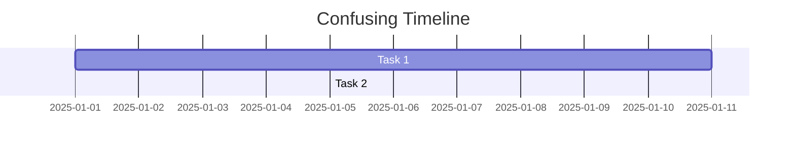
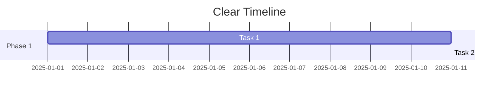
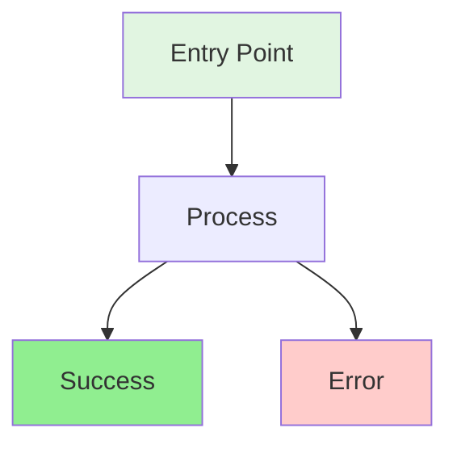
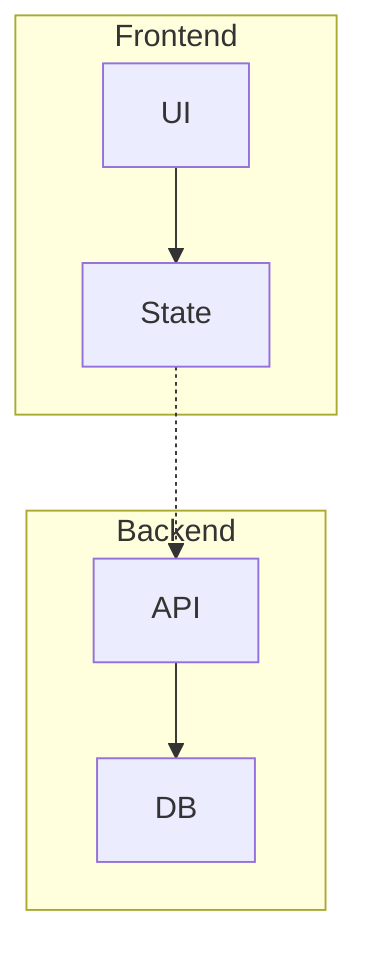
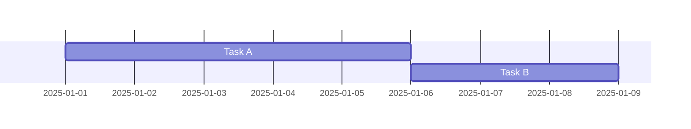
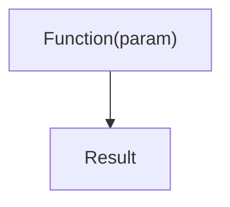

# Mermaid Diagram Optimization Rules

Critical rules for clean, readable Mermaid diagrams that render correctly.

---

## CRITICAL: Rendering Optimization Rules

### For ALL Diagram Types

**1. Prevent Overlapping & Crisscrossing**
- **Align subgraphs logically** → Stack vertically or position side-by-side with clear separation
- **Reduce cross-connections** → Minimize lines that cross over other elements
- **Use different link styles** → Differentiate relationships:
  - `-->` Solid arrows for primary flows
  - `-.->` Dashed arrows for secondary/cross-subgraph relationships
  - `..->` Dotted arrows for optional/conditional paths
- **Maintain natural reading order** → Default to `TD` (top-down) unless `LR` (left-right) is more logical
- **Ensure spacing** → Add whitespace between nodes to prevent clutter

**2. Clarity Best Practices**
- **Keep labels concise** → 2-5 words maximum per node
- **Group related items** → Use subgraphs for logical sections
- **Limit complexity** → If diagram has >15 nodes, consider breaking into multiple diagrams
- **Use consistent naming** → Follow a clear ID pattern (e.g., `step1`, `step2`, `decision1`)

**3. Syntax Error Prevention**
- **Avoid special characters** → Don't use `"`, `'`, `,`, or `()` in node IDs
- **Escape text with special chars** → Use quotes around labels: `A["Text with (special) chars"]`
- **Validate relationships** → Ensure all referenced IDs exist
- **Check bracket types** → Match opening/closing brackets correctly

---

### For Gantt Charts SPECIFICALLY

**4. Gantt-Specific Optimization**
- **Use correct date format** → Always `dateFormat YYYY-MM-DD`
- **Fix task dependencies** → Use `after [task_id]` to prevent date overlaps
- **Improve label placement** → Keep task names **short** so labels fit inside bars
- **Maintain clear phases** → Group related tasks under **section** headers
- **Ensure logical sequencing** → Later phases should start after key earlier tasks complete
- **Avoid manual date conflicts** → Don't specify overlapping dates for dependent tasks

**Example - Before (BAD):**


**Example - After (GOOD):**


---

### For Flowcharts SPECIFICALLY

**5. Flowchart Optimization**
- **Align decision branches** → Keep Yes/No paths visually balanced
- **Avoid diagonal flows** → Use orthogonal (90-degree) connections
- **Stack subgraphs vertically** → Prevents side-by-side overlap
- **Use dashed lines for exceptions** → Error paths, edge cases

**Example - Before (BAD):**
```mermaid
flowchart LR
    A --> B
    A --> C
    B --> D
    C --> D
    D --> B  ❌ Creates circular confusion
```

**Example - After (GOOD):**
```mermaid
flowchart TD
    A[Start] --> B{Check}
    B -->|Valid| C[Process]
    B -.->|Invalid| E[Error Handler]
    C --> D[Complete]
    E -.-> A  ✓ Clear flow with dashed error path
```

---

## Optimization Verification Checklist

Before finalizing ANY diagram, verify:

**Rendering Checks:**
- [ ] No syntax errors (valid Mermaid syntax)
- [ ] All IDs are unique and referenced correctly
- [ ] Date formats correct (Gantt charts)
- [ ] No unescaped special characters in labels

**Visual Clarity Checks:**
- [ ] No overlapping lines or nodes
- [ ] Proper spacing between elements
- [ ] Logical flow direction (TD/LR)
- [ ] Appropriate use of dashed/dotted lines
- [ ] Subgraphs aligned and separated

**Complexity Checks:**
- [ ] <15 nodes per diagram (or split into multiple)
- [ ] Labels are concise (2-5 words)
- [ ] Related items grouped logically
- [ ] Natural reading order maintained

---

## Styling Guidelines

### Color Coding



**Color Guide**:
- **Green** (`#e1f5e1`, `#90EE90`): Entry points, success states
- **Red** (`#ffcccb`): Error states, failures
- **Blue** (`#cce5ff`): Decision points, important processes
- **Yellow** (`#fff4cc`): Warning states, attention needed
- **Gray** (`#f0f0f0`): System actions, automated processes

---

## Common Pitfalls and Fixes

### Pitfall 1: Overlapping Connections
**Problem**: Lines crossing over nodes making diagram unreadable

**Solution**: Use subgraphs and different arrow styles


### Pitfall 2: Gantt Date Overlaps
**Problem**: Tasks with conflicting dates

**Solution**: Use `after` dependencies


### Pitfall 3: Too Complex
**Problem**: Diagram with 20+ nodes is unreadable

**Solution**: Break into multiple diagrams or use C4 levels

### Pitfall 4: Special Characters
**Problem**: Node IDs with parentheses break syntax

**Solution**: Escape labels with quotes


---

## Quality Checklist

Before finalizing diagrams, verify ALL of these:

**Content & Structure:**
- [ ] Diagram type appropriate for content
- [ ] All relationships/flows shown
- [ ] Labels clear and concise (2-5 words max)
- [ ] Color coding enhances understanding
- [ ] Edge cases documented
- [ ] Technical details included (if needed)
- [ ] Non-technical stakeholder can understand

**Rendering & Optimization:**
- [ ] Syntax is valid (will render correctly)
- [ ] No overlapping lines or crisscrossing connections
- [ ] Proper spacing between nodes/elements
- [ ] Subgraphs aligned logically (stacked or separated)
- [ ] Link styles differentiated (solid/dashed/dotted)
- [ ] Flow direction logical (TD/LR)
- [ ] Complexity limited (<15 nodes or split into multiple diagrams)

**Gantt-Specific (if applicable):**
- [ ] Date format is `YYYY-MM-DD`
- [ ] Task dependencies use `after [task_id]` correctly
- [ ] No overlapping dates for dependent tasks
- [ ] Task names are short (fit inside bars)
- [ ] Sections group related tasks clearly
- [ ] Phase transitions are logical
