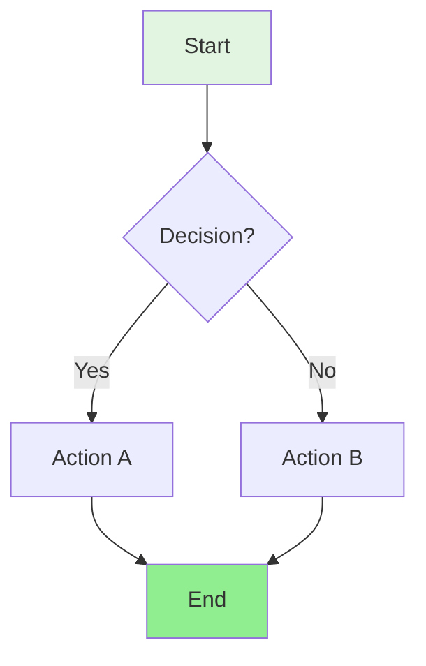
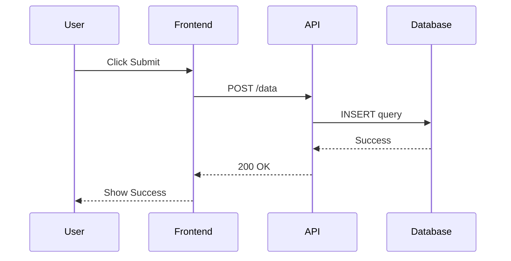
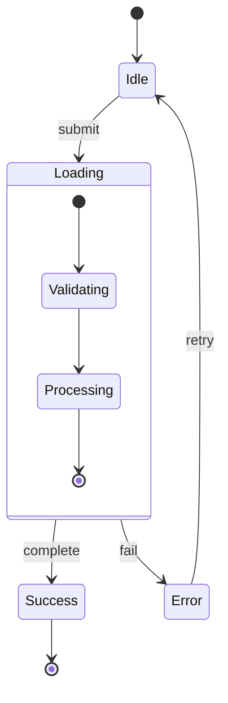
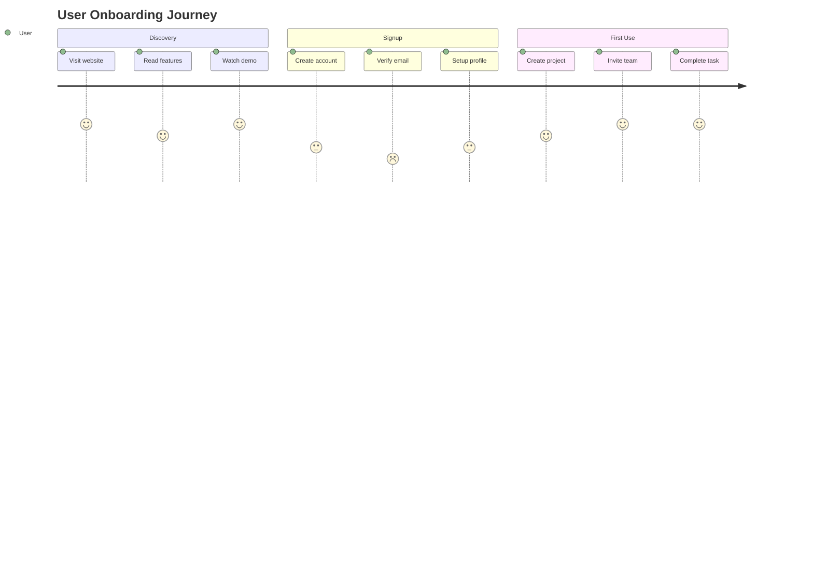
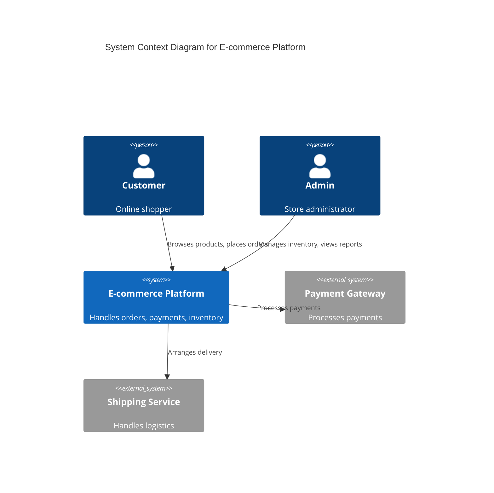
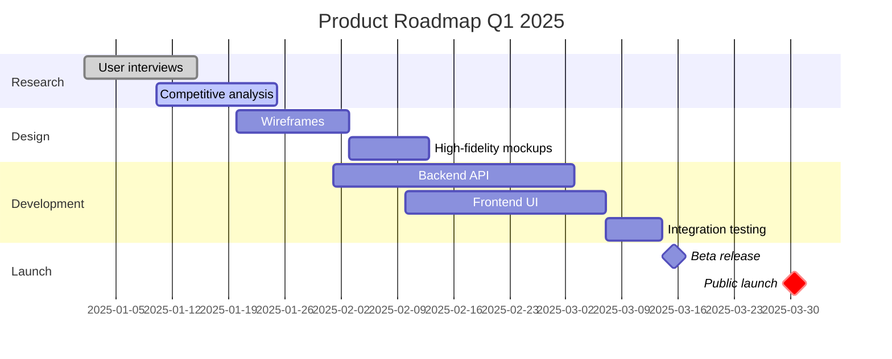
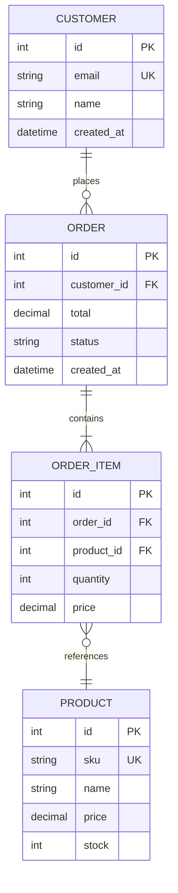

# Mermaid Diagram Syntax Reference

Complete syntax guide for all supported Mermaid diagram types.

---

## 1. Flowchart

**Best for**: Sequential processes with decision points, user flows

**Features**:
- Decision branches with `{ }`
- Multiple node shapes: `[ ]` `(( ))` `[( )]` `[[ ]]`
- Color styling with `style`
- Directional layouts: TD (top-down), LR (left-right)

**Node Shapes**:
- `[Text]` - Rectangle (standard process)
- `(Text)` - Rounded (start/end)
- `{Text}` - Diamond (decision)
- `[[Text]]` - Subroutine
- `[(Database)]` - Cylindrical (database)
- `((Text))` - Circle (connection point)

---

## 2. Sequence Diagram

**Best for**: System interactions, API flows, service communication

**Features**:
- Participant definitions
- Solid arrows `->` for requests
- Dashed arrows `-->` for responses
- Activation boxes
- Notes and loops

---

## 3. State Diagram

**Best for**: Application states, object lifecycles, workflow statuses

**Features**:
- Initial `[*]` and final states
- Transition labels
- Nested states
- Concurrent states with `--`

---

## 4. User Journey

**Best for**: Experience mapping with emotional sentiment

**Features**:
- Section grouping
- Sentiment scores (1-5)
- Actor assignment
- Timeline visualization

---

## 5. C4 Architecture Diagrams

**Best for**: System architecture, component relationships

**C4 Levels Supported**:
1. **Context**: System and external actors
2. **Container**: Applications, databases, microservices
3. **Component**: Internal modules and classes

**Use Cases**:
- System architecture overviews
- Service dependency mapping
- Technical architecture documentation

---

## 6. Gantt Charts

**Best for**: Project timelines, roadmaps, sprint planning

**Features**:
- Task dependencies with `after`
- Status markers: `done`, `active`, `crit`
- Milestones
- Section grouping
- Duration specification

---

## 7. Entity Relationship Diagrams

**Best for**: Database schemas, data models

**Relationship Types**:
- `||--||` One to one
- `||--o{` One to many
- `}o--o{` Many to many
- `||--o|` One to zero or one

**Field Notations**:
- `PK` Primary Key
- `FK` Foreign Key
- `UK` Unique Key
